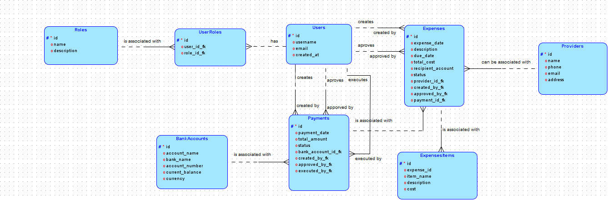

# Challenge WebApp

This project is a WebApp developed with **Flask** to manage bank accounts, payments, and expenses from a company.

## Table of Contents

- [Challenge WebApp](#challenge-webapp)
  - [Table of Contents](#table-of-contents)
  - [Features](#features)
  - [Requirements](#requirements)
  - [Installation](#installation)
  - [Flow diagram](#flow-diagram)
  - [ERD logical](#erd-logical)
  - [ERD relational](#erd-relational)

## Features

- View and manage expenses.
- Approve or cancel expenses.
- Generate payments for expenses.
- Approve or cancel payments.
- Execute payments and deduct bank account balances.
- Dashboard from [BoostrapMade](https://bootstrapmade.com/). Template [NiceAdmin](https://bootstrapmade.com/nice-admin-bootstrap-admin-html-template/).

## Requirements

- Python 3.12 or higher.
- PostgreSQL.
- Poetry for dependency management.

## Installation

1. Clone the repository:
   ```bash
   git clone https://github.com/diego200052/Challenge-WebApp
2. Create and activate a virtual environment:
   ```bash
   python3 -m venv .venv
   source .venv/bin/activate
3. Install dependencies:
   ```bash
   pip install poetry
   poetry install
4. Configure environment variables:
    ```bash
    ACTUAL_TIMEZONE
    DEBUG
    SECRET_KEY
    SECURITY_PASSWORD_SALT
    SECURITY_USER_IDENTITY_ATTRIBUTES
    CLIENT_ORIGIN
    API_URL
1. Start the server:
   ```bash
   sh run.sh

## Flow diagram


## ERD logical



## ERD relational

